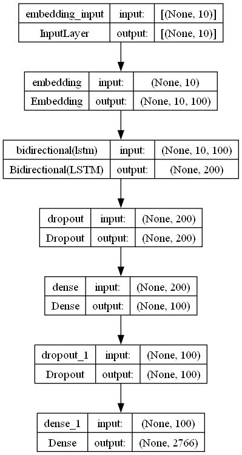

# Shonasence
A text generation model that will predict the next 3-5 Shona words likely to be typed.
It uses a bidirectional RNN under the hood, specifically an LSTM, to generate the text
sequences given an input text. You can check out the deployed app on Streamlit [here](https://shonasense.streamlit.app/)

## Model architecture
